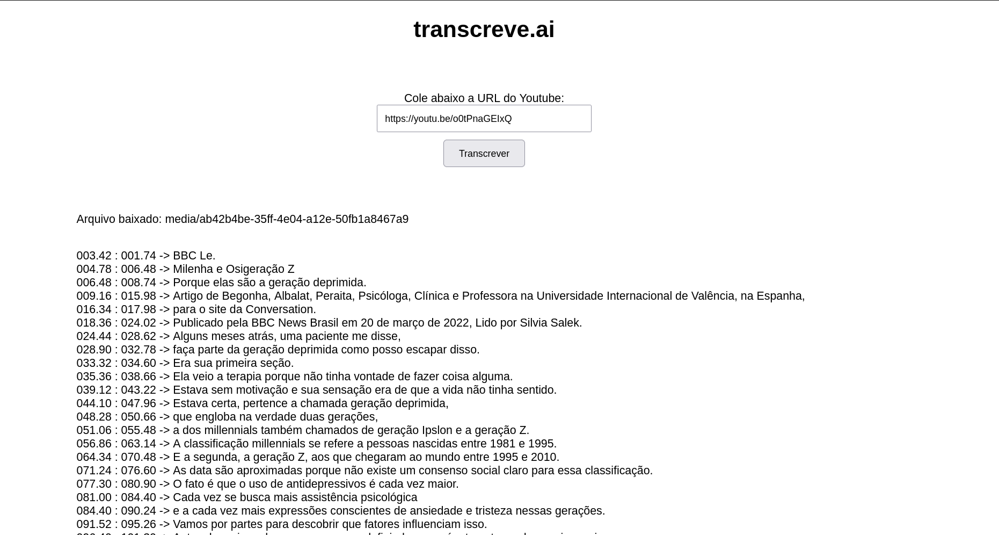

# django-transcreve-ai
##



## Running in Docker Environment
```sh
# ..
```

## Running in Local
```sh
python manage.py runserver
```
### Dependences:
- [FFmpeg](https://ffmpeg.org/)
    ```sh
    sudo apt install ffmpeg
    ```

